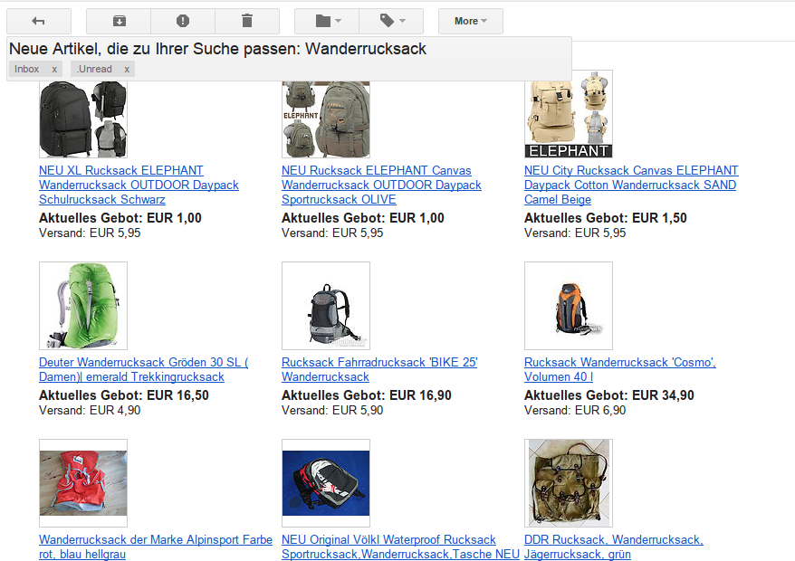

gmail-fixed-labels
==================

Chrome extension to transform Gmail labels into a fixed bar as if they were glued on.

# Screenshot 

# Download

[Chrome Webstore](https://chrome.google.com/webstore/detail/oaiihlknofchdhnonldnhcejeleciooh)

# Changelog

**1.6**

- Fixed wrong positioning after sending a message due to targeting multiple containers with same class name

**1.5**

- Added automatic top positioning based on [gmail-righttasks](https://github.com/ghinda/gmail-righttasks)

**1.4**

- Fixed double margin values for the message page

**1.3**

- Added margin to search page too

**1.2**

- Exclude margin-top setting for inbox page and only apply for message pages

**1.1**

- Increased margin and changed position to the top for better integration

**1.0**

- Initial release
