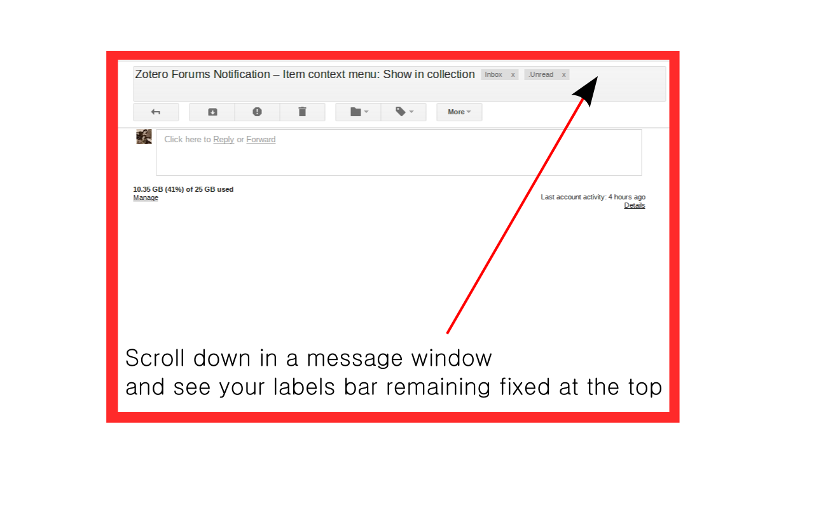

gmail-fixed-labels
==================

Chrome extension to make Gmail labels stick to the top as if they were glued on.

# Screenshot 

# Download

[Chrome Webstore](https://chrome.google.com/webstore/detail/oaiihlknofchdhnonldnhcejeleciooh)

# Changelog

**2.0**

- Add margin to #sent pages

**1.9**

- Fixed issue of positioning when searching for an email

**1.8**

- Fixed missing margin for #all pages
- Added min-width setting for the label bar
- Increased the margin to avoid overlapping with the "The label has been removed from the conversation" information box.

**1.7**

- Reverted changes from 1.6. They are not working correctly.

**1.6**

- Fixed wrong positioning after sending a message due to targeting multiple containers with same class name

**1.5**

- Added automatic top positioning based on [gmail-righttasks](https://github.com/ghinda/gmail-righttasks)

**1.4**

- Fixed double margin values for the message page

**1.3**

- Added margin to search page too

**1.2**

- Exclude margin-top setting for inbox page and only apply for message pages

**1.1**

- Increased margin and changed position to the top for better integration

**1.0**

- Initial release
